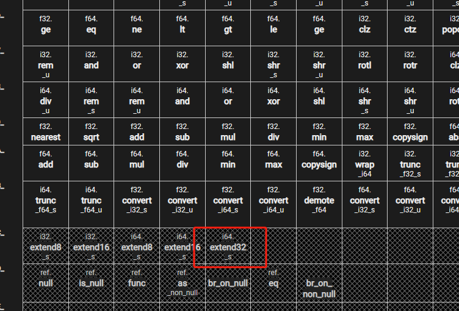
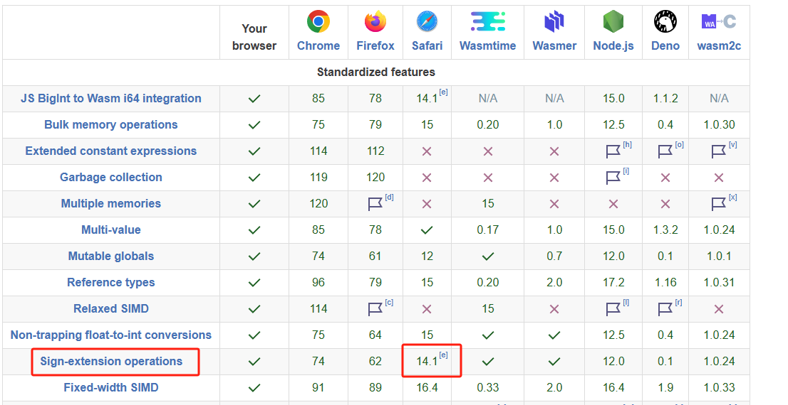

# 用途说明

由于我们项目UI使用了UTK，并且UTK在2022.3.10之前存在内存泄漏问题，因此后来升级到了写文档时的最新LTS：Unity2022.3.14。

此时，微信的minigame转换工具，并没有很好的支持此Unity版本，如：

* 使用了旧版本的emscripten编译选项
* 使用了不匹配的Exported Functions选项
* etc

经过调整和修复后，依然存在一个问题：**IOS14.4以下低端机无法启动**。

tl;dr ：此目录用于解决上述问题，见[步骤](#修复步骤)。

## 问题描述

IOS14.4在测试时必现`abort(0)`报错，经修改framework.js，增加调试信息后，定位到更有价值的错误信息：`invalid opcode 196`。



经查询196号指令为`i64.extend32_s`，隶属于sign-extesnion operators扩展指令集，此指令集最初是一个proposal，并不在标准(MVP features)中。

而在Emscripten3.1.x某个版本中sign-ext-feature成为默认开启选项，因此对于旧的浏览器内核，将不再支持。



> sign-extesnion operators supported in desktop Safari since 14.1 and iOS Safari since 14.5.

综上结论，解决此问题主要两种方法：

1. 用户端升级内核
2. 开发者端不生成sign-ext指令集opcode

## 分析及尝试

Unity2022.3.14的emscripten版本为3.1.8，binaryen版本为106。

最开始尝试通过额外的编译参数屏蔽扩展指令集，最终都没有效果。原因是在C#中传递的编译参数作用到了emcc上，但是并不影响wasm-opt阶段。并且Unity使用的wasm编译工具有bug，无法正确传递编译选项，详见[#19718](https://github.com/emscripten-core/emscripten/issues/19718)。

尝试过升级wasm编译工具版本，但是因为整个编译链行为差异，导致错误频出，最终放弃。计划采用以下2种方式修复问题：

1. wasm逆向，替换opcode，反逆向为原wasm
2. 修改binaryen编译器，在visit到sign-ext指令集的指令时，动态替换为标准指令。

方案一优点是实现简单，但是存在2个缺点：

1. 两次指令转换过程，延长了打包过程
2. 会影响到正常的文件hash生成和压缩，所以最终需要额外的hash计算和压缩。使打包过程更为繁琐

因此最终选择了方案2

## 最终解决方案

为尽可能实现无缝化替换，在binaryen github上找到了此Unity使用的对应[commit:967245fbc75217d257eeba15ede4aeb56e3c0d89](https://github.com/WebAssembly/binaryen/commits/967245fbc75217d257eeba15ede4aeb56e3c0d89)，并拉取到本地。

借鉴高版本的实现，增加了一个新的pass：SignExtLowering。用于实现对sign-extesnion operators扩展指令集的兼容化处理。

原指令集的作用是截断有符号数域，并提供了i32-8/16,i64-8/16/32共5个opcode。对应计算见[specific](https://webassembly.github.io/spec/core/exec/numerics.html#op-iextendn-s)

此pass实现了遍历一元运算符，判断是否是这5个指令，用一次左移和一次算术右移实现，并用拼接好的AST替换原AST。即如下伪指令：

```
T extend_N_s<T>(i32 N_bits, i64 a) where T is i32 or i64: 
    i32 bits_offset = sizeof(T) * 8 - N_bits;
    return a<<bits_offset>>>bits_offset;
```

在optimization phase中，默认加入此pass。


## 修复步骤

以Windows为例，MacOS类似

克隆此工程：

```shell
git clone git@github.com:labbbirder/Binaryen_For_U3D_2022_3_14.git binaryen_src
cd binaryen_src
```

编译：

```shell
cmake .
cmake --build . --config Release
```

如果成功，你将在此目录bin下看到wasm-opt.exe等文件

覆盖到UnityEditor安装目录，形如：`{UNITY_INSTALLATION_HOME}/202X.X.XXf1c1/Editor/Data/PlaybackEngines/WebGLSupport/BuildTools/Emscripten/binaryen`

删除项目工程的`Library/Bee`目录

检查替换效果（可选）：
```
wasm2wat build.wasm -o build.wat
```

## 后续工作注意事项

随着Unity、微信工具及真机市场的迭代升级，此部分将失去意义。之后如果需要继续这项工作，需要注意：

1. 由于Unity的Incremental Build Pipeline，替换Binaryen之后需要删除Library/Bee，或者Clean Build。不然不生效
2. 编译Binaryen时，需要指定Release模式，尽量对本机优化。不然打包很慢
